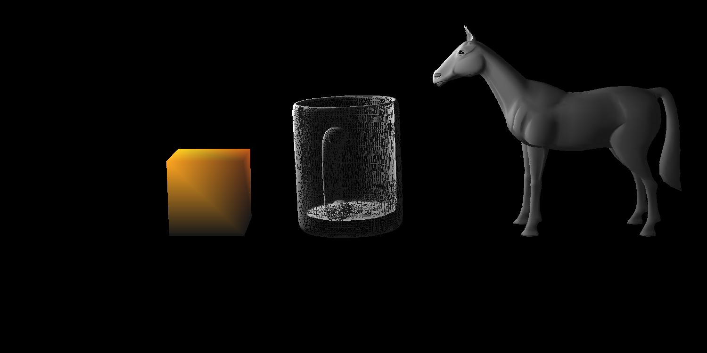

# ForwardPipelining

Implementation of Modeling Transformation, Viewing Transformation, and Rasterization stages of the Forward Rendering Pipeline.

# How to Run

```shell
$ make
$ ./rasterizer ./scene\ files/<sceneFile>_scene.txt ./camera\ files/<cameraFile>_camera.txt
```

# Example Result


